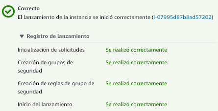
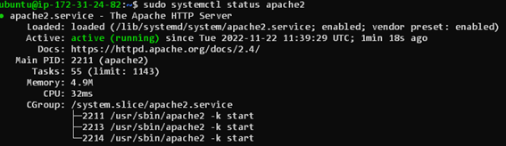
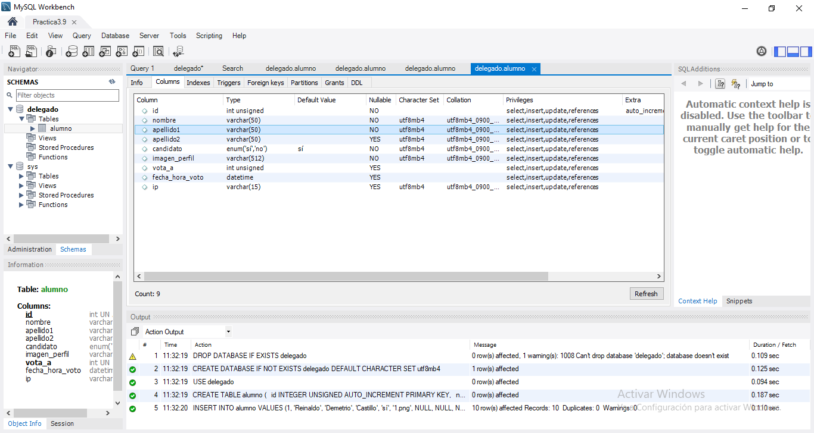
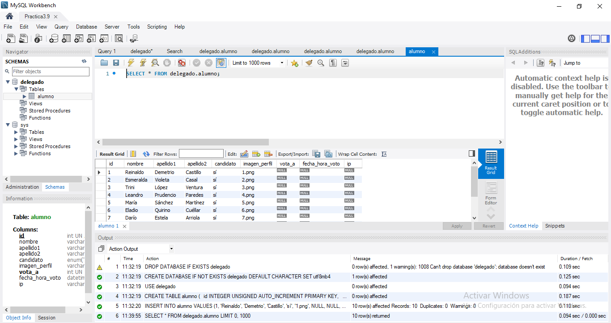
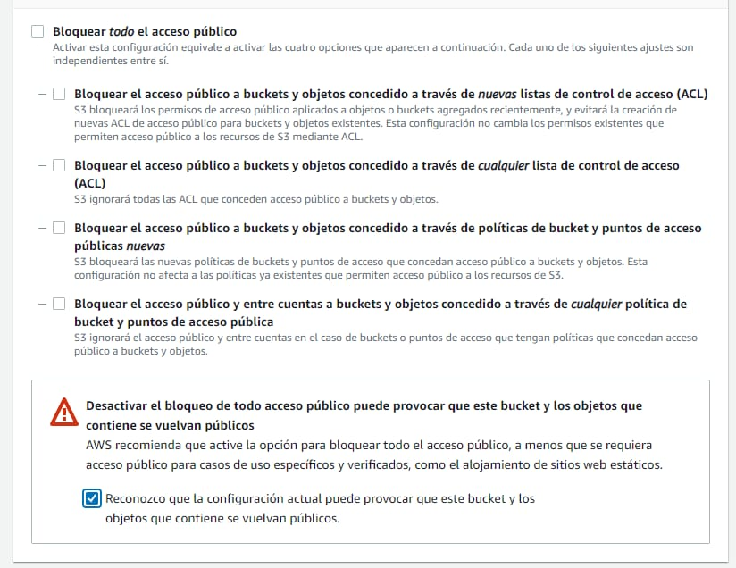
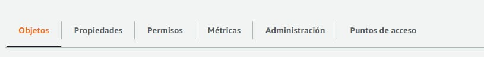
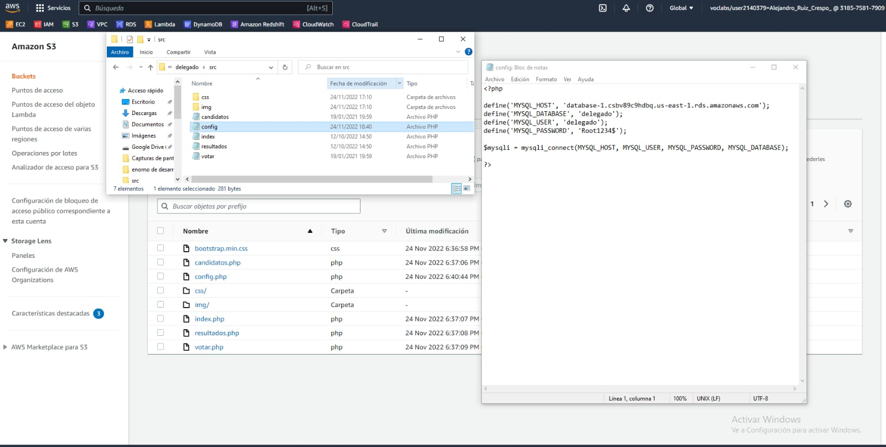

# Práctica 3.9: Despliegue web con bases de datos en AWS. Nivel básico.
#### Mónica Blanco, Alejandro Ruiz, Alejandro Priego

## EC2

1. Entramos a nuestro panel de Administración de AWS, concretamente en el servicio EC2 (Dentro de Computación)
   
2. Creamos una Instancia pulsando en "Lanzar Instancia":
   - Seleccionamos un nombre para nuestra máquina, en nuestro caso, "Practica1.9"
   - Seleccionamos el AMI o SO de nuestra máquina, usaremos "AMI Ubuntu 22.04"
   - Como tipo de máquina, elegiremos una t2.micro, la cual podemos usar sin coste en la capa gratuita. Esta se compone de:
     - 1 vCPU
     - 1GiB de RAM
   - Creamos un par de claves SSH para poder conectarnos posteriormente.
   - Habilitamos una IP Pública para poder acceder a la máquina desde el exterior
   - Creamos también un nuevo grupo de seguridad para definir reglas de entrada y salida personalizadas, en nuestro caso, por ahora, definiremos las reglas SSH (22), HTTP(80) y HTTPS(443), posteriormente definiremos otros
   - Asignamos 8GiB de disco duro a la máquina, en este caso en usaremos gp2

    

3. Le asignaremos una IP estática (IP Elástica en AWS):
   - Dentro del panel EC2, en el apartado izquierdo, seleccionamos IP Elástica
   - Creamos una nueva IP, haciendo click en  "Asignar IP Elástica"
   - Asociamos esta IP a nuestra máquina EC2
   - En nuestro caso, la IP asignada a la máquina EC2 es -->  [3.233.186.113](3.233.186.113)
   - Esta IP se asigna automáticamente como IP Pública de máquina

4. Nos conectamos a la instancia por SSH:
   - ssh -i zapatillas.pem ubuntu@3.233.186.113 

5. Instalamos Apache2:
   - sudo apt update
   - sudo apt install apache2
   - sudo systemctl apache2

    

6. Sincronizamos la carpeta pública del servidor Apache con el contenido del Bucket S3:
   - Al tratarse de un servidor Ubuntu Server, debemos instalar AWS-CLI
     - sudo apt install awscli
   - Una vez instalada esta utilidad, sincronizamos el contenido con:
     - sudo aws s3 sync s3://trabajoconjunto /var/www/html

7. Instalamos PHP para que Apache sea capaz de interpretar nuestro programa Web
   - sudo apt install php libapache2-mod-php php-mysql

## RDS

- Crear la  database (Crear una base de datos), seleccione Create database.
Ahora dispone de varias opciones de motor.  Hacer clic en el ícono de MySQL, seleccione Only enable options eligible for RDS Free Usage Tier (Permitir solo opciones elegibles para la capa de uso gratuita de RDS) y luego haga clic en Next (Siguiente).

- Configurar la instancia de base de datos. La siguiente lista muestra un ejemplo de la configuración que puede utilizar para este tutorial:

Especificaciones de la instancia:

- Modelo de licencia: seleccione la licencia pública general predeterminada para usar el acuerdo de licencia general para MySQL. MySQL tiene solamente un modelo de licencia.
Versión del motor de la base de datos: seleccione la versión predeterminada de MySQL. Tenga en cuenta que Amazon RDS admite múltiples versiones de MySQL en determinadas regiones.
-   Clase de la instancia de base de datos: seleccione db.t2.micro --- 1vCPU, 1 GIB RAM.  Eso equivale a 1 GB de memoria y 1 vCPU. Para ver una lista de clases de instancias compatibles, consulte los detalles del producto de Amazon RDS.
- Implementación Multi-AZ: tenga en cuenta que las implementaciones Multi-AZ conllevan un cargo. Usar una implementación Multi-AZ aprovisionará y mantendrá automáticamente una réplica en espera síncrona en una zona de disponibilidad distinta.  Para obtener más información, consulte Implementación de alta disponibilidad.
- Tipo de almacenamiento: seleccione General Purpose (SSD) (Uso general, SSD). Para obtener más información acerca del almacenamiento, consulte Almacenamiento para Amazon RDS.
- Almacenamiento asignado: seleccione el valor predeterminado 20 para asignar 20 GB de almacenamiento a su base de datos.  Puede escalar hasta un máximo de 16 TB con Amazon RDS for MySQL.
- Habilitar el escalado automático del almacenamiento: si la carga de trabajo es cíclica o impredecible, debe habilitar el escalado automático del almacenamiento para permitir que RDS aumente automáticamente su almacenamiento cuando sea necesario. Esta opción no se aplica a este tutorial.

Configuración:

- Identificador de instancias de base de datos: escriba un nombre para la instancia de base de datos que sea exclusivo para su cuenta en la región que haya seleccionado. En este tutorial, elegiremos el nombre rds-mysql-10minTutorial.
- Nombre de usuario maestro: escriba el nombre de usuario que utilizará para iniciar sesión en su instancia de base de datos. En este ejemplo, usaremos masterUsername.
- Contraseña maestra: escriba una contraseña que contenga entre 8 y 41 caracteres ASCII imprimibles (excluidos /," y @) para la contraseña del usuario maestro.
- Confirmar contraseña: vuelva a escribir la contraseña.
- Almacenamiento asignado: escriba 5 para asignar 5 GB de almacenamiento a su base de datos. Si desea obtener más información acerca de la asignación de almacenamiento, consulte las características de Amazon Relational Database Service (pedido de cambio, su tipo de almacenamiento posterior)

Ahora Configure Advanced Settings (Configuración avanzada):
- donde puede proporcionar información adicional que RDS necesita para implementar la instancia de base de datos MySQL. La siguiente lista muestra la configuración de nuestra instancia de base de datos de ejemplo.
Red y seguridad

- Virtual Private Cloud (VPC): seleccione Default VPC (VPC predeterminada). Para obtener más información sobre las VPC, consulte Amazon RDS y Amazon Virtual Private Cloud (VPC).
- Subnet group (Grupo de subred): elija el grupo de subred predeterminado.
- Public accessibliity (Accesibilidad pública): seleccione Yes (Sí). Se asignará una dirección IP para su instancia de base de datos de forma que pueda conectarse directamente a la base de datos desde su propio dispositivo.
- Availability zone (Zona de disponibilidad): elija No Preference (Sin preferencias). Para obtener más información, consulte Regiones y zonas de disponibilidad.
- VPC security groups (Grupos de seguridad de VPC): seleccione Create new VPC security group (Crear nuevo grupo de seguridad de VPC). Se creará un grupo de seguridad que permitirá la conexión de la dirección IP del dispositivo que está utilizando en la actualidad a la base de datos creada.

Opciones de base de datos:

 - Database name (Nombre de la base de datos): escriba un nombre de la base de datos que contenga entre 1 y 64 caracteres alfanuméricos. Si no introduce un nombre, Amazon RDS no creará una base de datos automáticamente en la instancia de base de datos que está creando.

- Port (Puerto): deje el valor por defecto, 3306.

- DB parameter group (Grupo de parámetros de la base de datos): deje el valor por defecto, default.mysql5.6. Para obtener más información, consulte Trabajo con los grupos de parámetros de base de datos.

- Option group (Grupo de opciones): seleccione el valor predeterminado, default.mysql5.
- Autenticación de base de datos IAM: seleccione Disable (Deshabilitar). Esta opción permite administrar las credenciales de la base de datos usando los grupos y usuarios de AWS IAM.

Cifrado

- Esta opción no está disponible en la capa gratuita. 

Copia de seguridad
- Periodo de retención del backup: puede elegir la cantidad de días que se retiene el backup que realice. Para este tutorial, elija el valor 1 día.
- Ventana de backup: seleccione el valor predeterminado, No Preference (Sin preferencias).

Información sobre rendimiento

- Seleccione Disable Performance Insights (Deshabilitar información sobre rendimiento) 

Mantenimiento

- Actualización de versión secundaria automática: seleccione Enable auto minor version upgrade (Habilitar actualización de versión secundaria automática) para obtener actualizaciones automáticas cuando estén disponibles.

- Ventana de mantenimiento: seleccione No Preference (Sin preferencias).

Protección ante eliminaciones: 

- Elimine Enable deletion protection (Habilitar protección de eliminación).
 

Haga clic en Create database (Crear base de datos).

Se está creando su instancia de base de datos.  Haga clic en View Your DB Instances (Ver sus instancias de base de datos).

- La nueva instancia de base de datos aparece en la lista de instancias de base de datos en la consola de RDS. La instancia de base de datos se encontrará en estado creating (creándose) hasta que esté creada y lista para utilizar.  Cuando el estado cambie a available (disponible), podrá conectarse a una base de datos de la instancia de base de datos. 

Descargar un cliente SQL

- Una vez que se haya creado la instancia de base de datos y se encuentre en estado "available", puede conectarse a MySQL Workbench.

Conectarse a la base de datos MySQL

- Nos conectaremos a la base de datos que ha creado con MySQL Workbench.

Iniciar la aplicación MySQL Workbench y vaya a Database > Connect to Database (Base de datos > Conectar con base de datos).

En el cuadro de diálogo.  Escribe lo siguiente:

- Hostname (Nombre de host): puede encontrar su nombre de host en la consola de Amazon RDS, tal y como se muestra en la imagen de la derecha.  

- Port (Puerto): el valor predeterminado debería ser 3306.

- Username (Nombre de usuario): escriba el nombre de usuario que ha creado para la base de datos de Amazon RDS.  En este tutorial, es “masterUsername“.

- Password (Contraseña): haga clic en Store in Vault (o Store in Keychain en MacOS) e introduzca la contraseña que usó al crear la base de datos de Amazon RDS.

## S3 

 1.-  Iniciamos el laboratorio y nos vamos a instancias S3 

2.-  Le damos al recuadro naranja para crear un nuevo bucket

 

3.- Lo configuramos con el nombre que queramos y lo configuramos para que tenga una accesibilidad abierta. Para ello deseleccionamos la opción de BLOQUEAR TODO EL ACCESO PÚBLICO y aceptamos la advertencia. 
    
    

4 Para subir el juego necesitaremos irnos a la ventana de objetos

5 Una vez ahí, abrimos la ruta del la carpeta y la cargamos en el bucket. 

6.- Previo a esto, tendremos que editar el config.php del juego para conectarlo a la base de datos. 
    